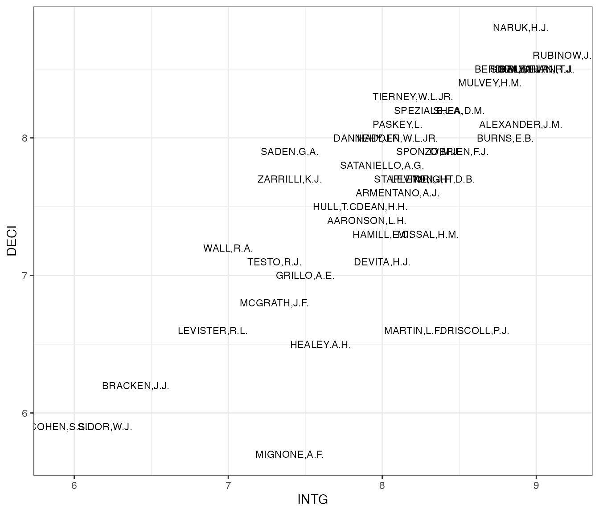
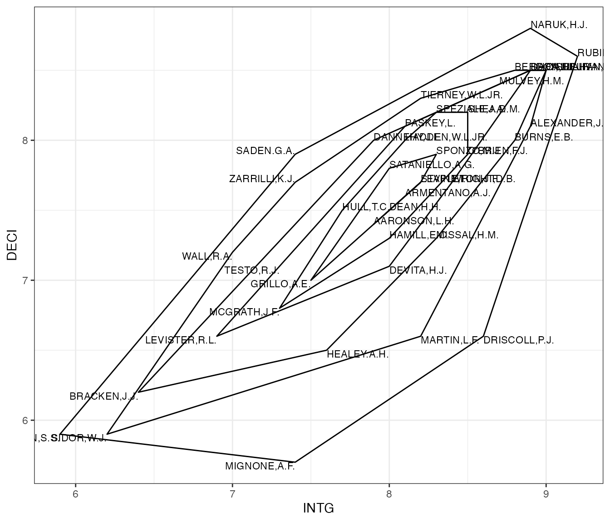
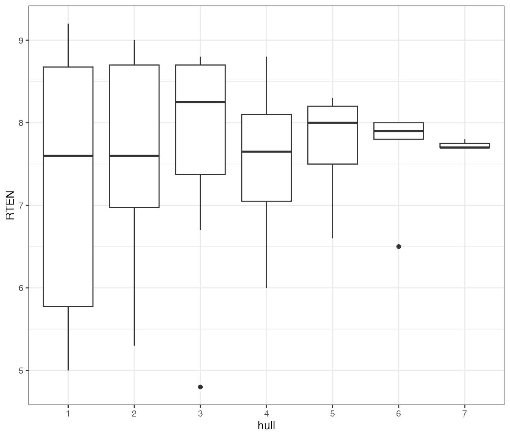
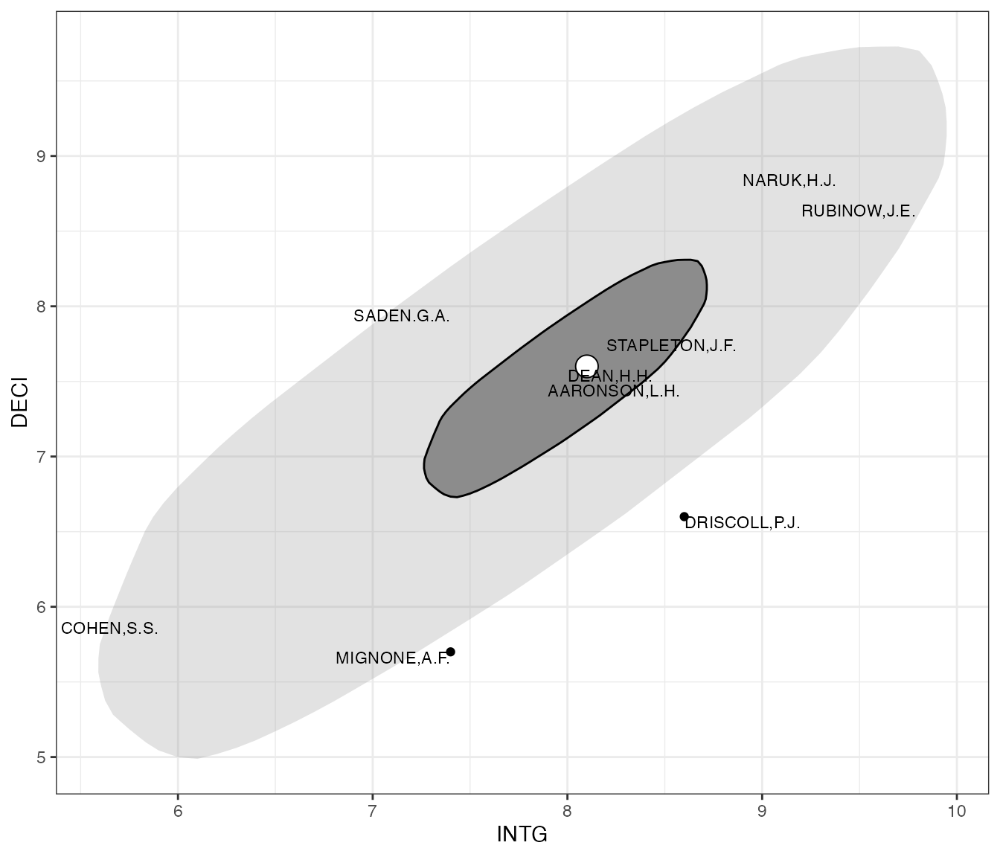
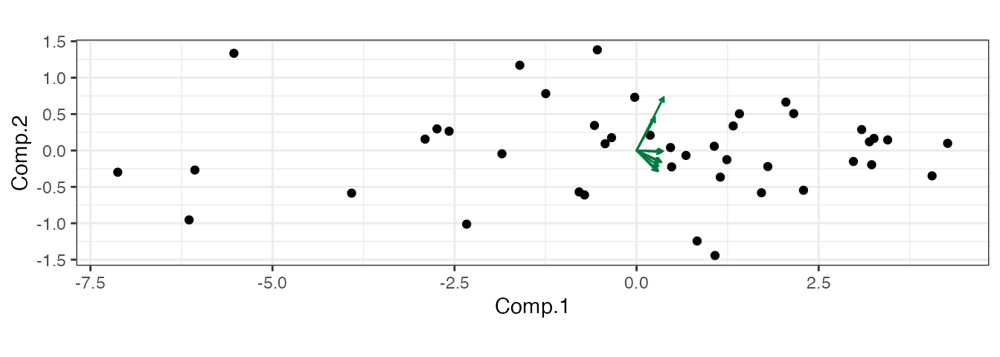
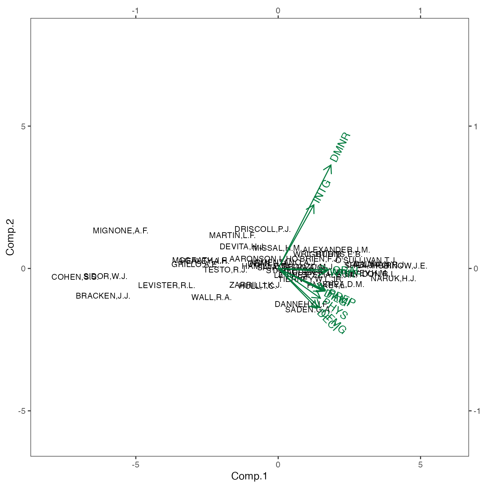
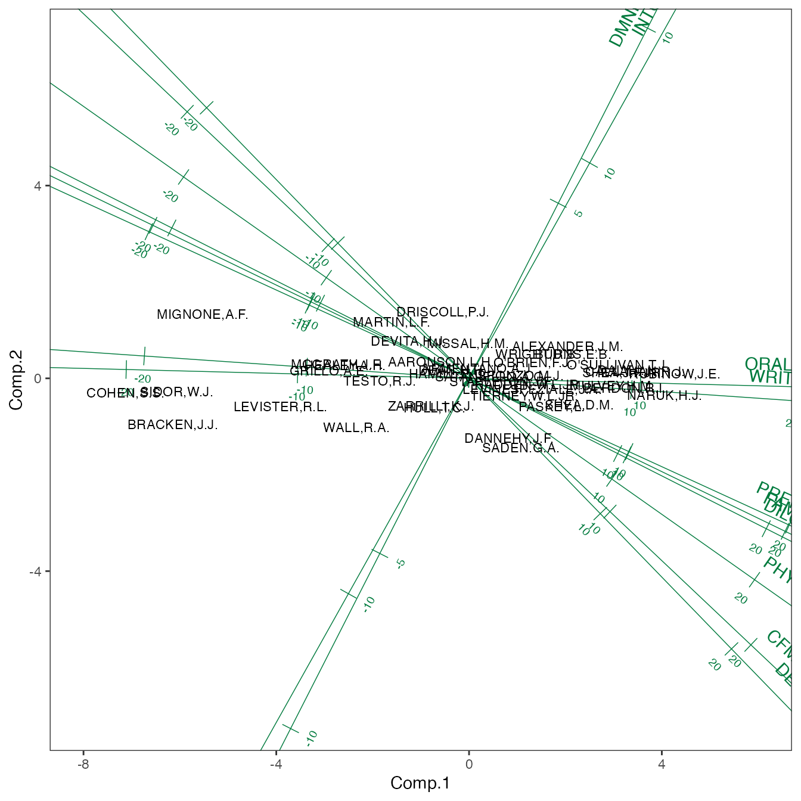
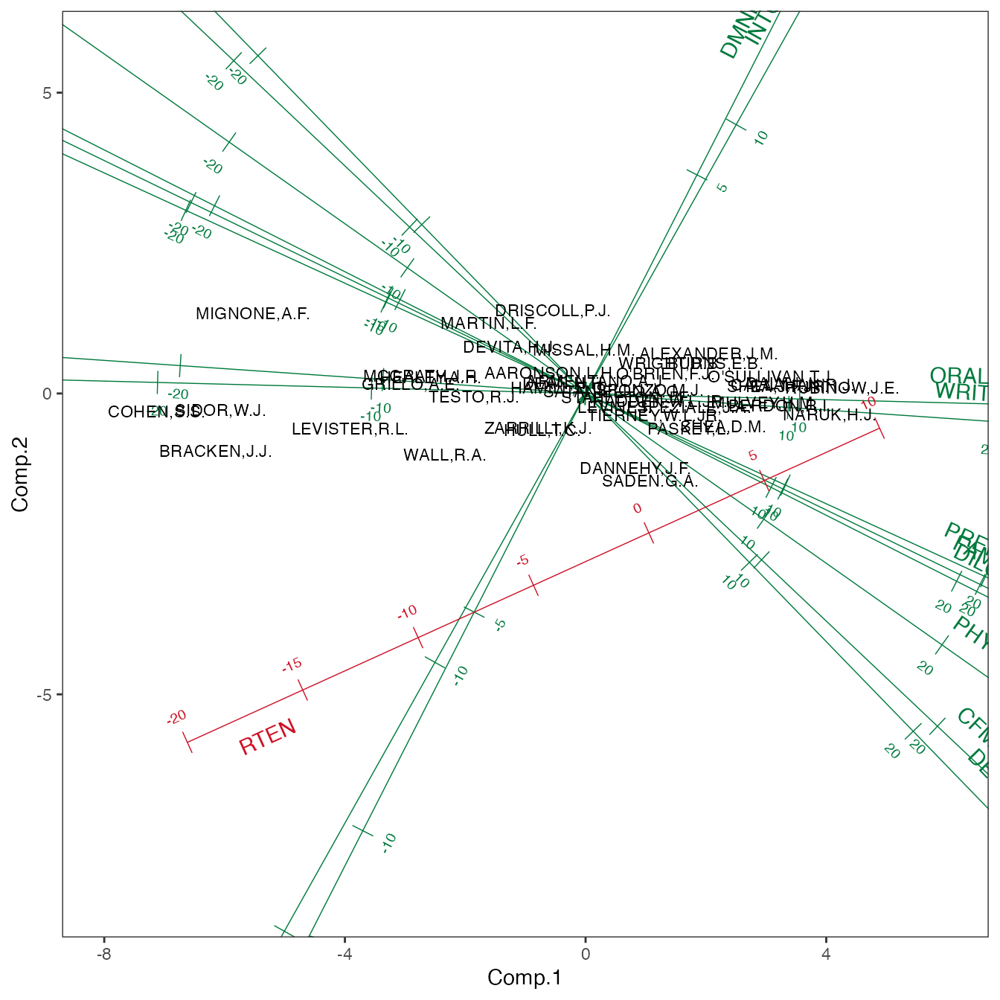

# Visualizing Multivariate Data in {ggplot2}

## Introduction

The {gggda} package is a mostly standard-issue extension to
[{ggplot2}](https://github.com/tidyverse/ggplot2): It consists of
[ggprotos](https://ggplot2.tidyverse.org/reference/ggplot2-ggproto.html)
for a coordinate system (“coord”) and several statistical
transformations (“stat”), and geographic constructions (“geom”) that
almost exclusively use standard aesthetic mappings and recognizable
parameters and defaults.

The coords, stats, and geoms implement a variety of tools used in
multivariate data analysis. By design, tools implemented in other
{ggplot2} extensions are not reinvented here—or, at least, they’re not
meant to be! For example, [the {ggdensity}
package](https://github.com/jamesotto852/ggdensity) provides plot layers
for quantile-based density estimates and contours, extending the native
{ggplot2} layers for level-based density visualizations, and users are
encouraged to use it in tandem with the {gggda}. As a result, though,
those included in the package may seem somewhat arbitrary. That said,
the plot layers provided by {gggda} implement methods that emerged from
two distinct threads, which the vignette will consider in turn.

``` r

library(gggda)
#> Loading required package: ggplot2
theme_set(theme_bw())
```

A brief caution: Some code below uses the
[`sort_by()`](https://rdrr.io/r/base/sort_by.html) function [introduced
in R version
4.4.0](https://github.com/wch/r-source/blob/edd57ecc73890eac2a290dbeb04e54f9cbeac77f/doc/NEWS.Rd#L1151);
if that version is not yet installed, an invisible code chunk is run
that defines it from scratch.

### Data

To motivate and illustrate these tools, let’s investigate the
`USJudgeRatings` data set included with the basic `R` installation.
These data were obtained from the 1977 *New Haven Register* and contain
several lawyers’ evaluations of 43 Superior Court[^1] judges based, or
so i infer (i have not found a journal article citation or been able to
access the newspaper edition), on a number of interactions with them.
The variables include the (standardized) number of interactions, ratings
of 10 criteria ranging from judicial integrity to physical ability, and
a final rating of retention worthiness; the ratings all use a 10-point
scale. Here are those ratings for a sample of the judges:

``` r

print(USJudgeRatings[sample(nrow(USJudgeRatings), 6L, replace = FALSE), ])
#>                CONT INTG DMNR DILG CFMG DECI PREP FAMI ORAL WRIT PHYS RTEN
#> MIGNONE,A.F.    6.6  7.4  6.2  6.2  5.4  5.7  5.8  5.9  5.2  5.8  4.7  5.2
#> DEVITA,H.J.     6.5  8.0  7.6  7.2  7.0  7.1  6.9  7.0  7.0  7.1  6.9  7.2
#> SPONZO,M.J.     6.9  8.3  8.0  8.1  7.9  7.9  7.9  7.7  7.6  7.7  8.1  8.0
#> STAPLETON,J.F.  6.5  8.2  7.7  7.8  7.6  7.7  7.7  7.7  7.5  7.6  8.5  7.7
#> SADEN.G.A.      6.6  7.4  6.9  8.4  8.0  7.9  8.2  8.4  7.7  7.9  8.4  7.5
#> BERDON,R.I.     6.8  8.8  8.5  8.8  8.3  8.5  8.7  8.7  8.4  8.5  8.8  8.7
```

For convenience, we reformat the data with an additional column for the
name of the judge:

``` r

USJudgeRatings %>% 
  tibble::rownames_to_column(var = "NAME") ->
  judge_ratings
head(judge_ratings)
#>             NAME CONT INTG DMNR DILG CFMG DECI PREP FAMI ORAL WRIT PHYS RTEN
#> 1  AARONSON,L.H.  5.7  7.9  7.7  7.3  7.1  7.4  7.1  7.1  7.1  7.0  8.3  7.8
#> 2 ALEXANDER,J.M.  6.8  8.9  8.8  8.5  7.8  8.1  8.0  8.0  7.8  7.9  8.5  8.7
#> 3 ARMENTANO,A.J.  7.2  8.1  7.8  7.8  7.5  7.6  7.5  7.5  7.3  7.4  7.9  7.8
#> 4    BERDON,R.I.  6.8  8.8  8.5  8.8  8.3  8.5  8.7  8.7  8.4  8.5  8.8  8.7
#> 5   BRACKEN,J.J.  7.3  6.4  4.3  6.5  6.0  6.2  5.7  5.7  5.1  5.3  5.5  4.8
#> 6     BURNS,E.B.  6.2  8.8  8.7  8.5  7.9  8.0  8.1  8.0  8.0  8.0  8.6  8.6
```

## Multivariate summaries

The first set of methods is the extension of univariate summaries to
multivariate, and usually bivariate, data. For example, univariate data
have a natural ranking by value: Arrange the cases in order of a
variable value, and the rank of each case is its position in order:

``` r

judge_ratings %>% 
  subset(select = c(NAME, RTEN)) %>% 
  sort_by(~ list(-RTEN)) %>% 
  transform(RANK = seq(nrow(judge_ratings))) %>% 
  head()
#>              NAME RTEN RANK
#> 30   RUBINOW,J.E.  9.2    1
#> 7   CALLAHAN,R.J.  9.0    2
#> 26     NARUK,H.J.  9.0    3
#> 9       DALY,J.J.  8.8    4
#> 34   SHEA,J.F.JR.  8.8    5
#> 2  ALEXANDER,J.M.  8.7    6
```

There’s no obvious analog to this for bivariate data: Suppose we want to
rank judges by how well they maintain the legitimacy of their court.
This might implicate two ratings in the data in particular, their
integrity and the promptness of their decisions:

``` r

judge_plot <- ggplot(judge_ratings, aes(x = INTG, y = DECI, label = NAME))
judge_plot +
  geom_text(aes(label = NAME), size = 3)
```



While these ratings are correlated, several individual judges were rated
significantly more highly on one criterion than on the other, and there
is a clear “core” of judges who received average ratings on both. In the
next section we’ll see how these ratings might be combined into an
aggregate; for now, we’ll consider how to rank the judges not by the
values of their ratings but by their typicality or “averageness”: On
this score, middling judges should be ranked highly while outlying
judges should be ranked lowly. Such a measure might be useful for
identifying idiosyncratic judges for recruitment to consensus working
groups or even those whose rankings should be re-evaluated. Visually,
this property can be captured by sequentially “peeling” outer layers of
the point cloud and giving each layer the same rank. The most common way
to do this is probably via convex hulls:

``` r

judge_plot +
  geom_text(size = 3, hjust = "outward", vjust = "outward") +
  stat_peel(num = Inf, color = "black", fill = "transparent")
#> Warning: The following aesthetics were dropped during statistical transformation: label.
#> ℹ This can happen when ggplot fails to infer the correct grouping structure in
#>   the data.
#> ℹ Did you forget to specify a `group` aesthetic or to convert a numerical
#>   variable into a factor?
```



The plot identifies Judges Saden and Driscoll, for example, as outliers,
despite their average or just-below-average ratings on both criteria.
The more middling judges’ names are harder to read, but we can extract
the assignments directly to examine the most peripheral and core hulls:

``` r

judge_ratings %>% 
  subset(select = c(INTG, DECI)) %>% 
  peel_hulls(num = Inf) %>% 
  as.data.frame() %>% 
  merge(
    transform(judge_ratings, i = seq(nrow(judge_ratings))),
    by = "i"
  ) %>% 
  subset(select = -c(i, x, y, prop)) %>% 
  sort_by(~ hull + NAME) ->
  judge_hulls
judge_hulls %>% 
  subset(subset = hull %in% range(hull))
#>    hull           NAME CONT INTG DMNR DILG CFMG DECI PREP FAMI ORAL WRIT PHYS
#> 8     1     COHEN,S.S.  7.0  5.9  4.9  5.1  5.4  5.9  4.8  5.1  4.7  4.9  6.8
#> 13    1  DRISCOLL,P.J.  6.7  8.6  8.2  6.8  6.9  6.6  7.1  7.3  7.2  7.2  8.1
#> 23    1   MIGNONE,A.F.  6.6  7.4  6.2  6.2  5.4  5.7  5.8  5.9  5.2  5.8  4.7
#> 26    1     NARUK,H.J.  7.8  8.9  8.7  8.9  8.7  8.8  8.9  9.0  8.8  8.9  9.0
#> 30    1   RUBINOW,J.E.  7.1  9.2  9.0  9.0  8.4  8.6  9.1  9.1  8.9  9.0  8.9
#> 31    1     SADEN.G.A.  6.6  7.4  6.9  8.4  8.0  7.9  8.2  8.4  7.7  7.9  8.4
#> 1     7  AARONSON,L.H.  5.7  7.9  7.7  7.3  7.1  7.4  7.1  7.1  7.1  7.0  8.3
#> 11    7      DEAN,H.H.  7.0  8.0  7.6  7.4  7.3  7.5  7.1  7.2  7.1  7.2  8.4
#> 38    7 STAPLETON,J.F.  6.5  8.2  7.7  7.8  7.6  7.7  7.7  7.7  7.5  7.6  8.5
#>    RTEN
#> 8   5.0
#> 13  7.7
#> 23  5.2
#> 26  9.0
#> 30  9.2
#> 31  7.5
#> 1   7.8
#> 11  7.7
#> 38  7.7
```

Judges Aaronson, Armentano, and Stapleton constitute the innermost hull,
and again the density of the core makes it difficult to build intuition
about this stratification. We can, for example, check whether
peripherality with respect to the nested hulls is systematically related
to overall retention rating:

``` r

judge_hulls %>% 
  transform(hull = factor(hull, levels = seq(max(hull)))) %>% 
  ggplot(aes(x = hull, y = RTEN)) +
  geom_boxplot()
```



While the fewer data in each hull yield narrower boxplots, there is no
evident upward or downward trend. But peeling data from the outside
inward is not the only way to stratify by centrality. Another approach
is is called *data depth*, based on a family of notions of *global*
depth that are distinct from *local* notions of density. One of the most
famous deployments of data depth is the “bag-and-bolster plot”
comprising a “bag” delineated by a depth contour and a “fence” by
expanding the bag outward from the depth median. As with a
box-and-whisker plot, markers outside the fence identify outliers. In
the bag-and-bolster plot below, we used trial and error to customize the
fraction contained in the bag and the scale factor of the fence, add
text labels to the judges of the outermost and innermost hulls:

``` r

judge_plot +
  stat_bagplot(fraction = 1/3, coef = 3) +
  geom_text(
    data = subset(judge_hulls, hull %in% range(hull)),
    size = 3, hjust = "outward", vjust = "outward"
  )
```



For these data, the two stratifications are broadly consistent. However,
the data seem to have a greater skew toward lower values on the
periphery than in the core, resulting in Judges Naruk and Rubinow lying
well within the fence while Judges Cohen and Mignone lie near its
boundary, despite all four belonging to the outermost hull.

## Ordination and biplots

The second set of methods enables analysis of many variables at once.
These *ordination* models typically use linear algebra to obtain a
sequence of artificial coordinates, each of which captures the most
desired behavior after adjusting for the previous. In the most popular
ordination model, principal components analysis, the principal
components (PCs) account for the maximum amount of inertia, or
multidimensional variance in each successive residual subspace.

PCA is often applied to heterogeneous data, which requires that the
variables be rescaled to have common variance. In this case, however,
each criterion is rated on the same scale, so the simplifying assumption
that their distributions (specifically their variances) are equivalent
in the population is plausible.

``` r

judge_ratings %>% 
  subset(select = -c(NAME, CONT, RTEN)) %>% 
  princomp(cor = FALSE) ->
  judge_pca
```

As a technique for dimension reduction, PCA works best when the
variables are highly dependent—not necessarily pairwise correlated, but
such that the low-dimensional subspace coordinatized by the first few
PCs contains a large share of the inertia. The componentwise variance
and cumulative inertia are reported in the summary. We also examine the
variable loadings onto the PCs, which allow us to interpret the PCs as
latent variables (as in factor analysis, though the theoretical
justification is weaker and their meanings are less straightforward).

``` r

summary(judge_pca)
#> Importance of components:
#>                           Comp.1     Comp.2     Comp.3      Comp.4      Comp.5
#> Standard deviation     2.7951637 0.60340001 0.46035803 0.272421916 0.170365235
#> Proportion of Variance 0.9158885 0.04268141 0.02484389 0.008699859 0.003402437
#> Cumulative Proportion  0.9158885 0.95856994 0.98341383 0.992113689 0.995516126
#>                             Comp.6      Comp.7       Comp.8       Comp.9
#> Standard deviation     0.121735488 0.111429240 0.0726587640 0.0616838629
#> Proportion of Variance 0.001737251 0.001455548 0.0006188767 0.0004460374
#> Cumulative Proportion  0.997253377 0.998708925 0.9993278015 0.9997738389
#>                             Comp.10
#> Standard deviation     0.0439232932
#> Proportion of Variance 0.0002261611
#> Cumulative Proportion  1.0000000000
print(judge_pca$loadings)
#> 
#> Loadings:
#>      Comp.1 Comp.2 Comp.3 Comp.4 Comp.5 Comp.6 Comp.7 Comp.8 Comp.9 Comp.10
#> INTG  0.250  0.447  0.135         0.464  0.650  0.157  0.236               
#> DMNR  0.370  0.727 -0.171  0.214 -0.295 -0.385               -0.132        
#> DILG  0.308 -0.156  0.301  0.335  0.590 -0.393  0.145 -0.379               
#> CFMG  0.292 -0.277         0.509 -0.155  0.342 -0.614        -0.241        
#> DECI  0.272 -0.281         0.387 -0.391  0.115  0.685  0.201  0.144        
#> PREP  0.332 -0.152  0.220 -0.146        -0.328 -0.252  0.638  0.312  0.336 
#> FAMI  0.328 -0.159  0.224 -0.491                       0.160 -0.511 -0.525 
#> ORAL  0.356               -0.234 -0.135  0.133 -0.163 -0.371  0.701 -0.355 
#> WRIT  0.337         0.152 -0.306 -0.221  0.137        -0.433 -0.206  0.683 
#> PHYS  0.296 -0.209 -0.860 -0.149  0.297                                    
#> 
#>                Comp.1 Comp.2 Comp.3 Comp.4 Comp.5 Comp.6 Comp.7 Comp.8 Comp.9
#> SS loadings       1.0    1.0    1.0    1.0    1.0    1.0    1.0    1.0    1.0
#> Proportion Var    0.1    0.1    0.1    0.1    0.1    0.1    0.1    0.1    0.1
#> Cumulative Var    0.1    0.2    0.3    0.4    0.5    0.6    0.7    0.8    0.9
#>                Comp.10
#> SS loadings        1.0
#> Proportion Var     0.1
#> Cumulative Var     1.0
```

The PCA summary shows that the vast majority of the variance (92%)
already lies in a single dimension, along the first PC, and that roughly
half of the remainder (4%) lies along the second; 96% lies within the
plane of the first two PCs and would therefore be visualized in a plot
using them as axes. The loadings suggest that some of the ratings
(diligence, soundness of oral and written rulings) align more closely
with PC1 and some (integrity and demeanor) with PC2, while others
(management of case flow, promptness of decisions, physical ability) are
similarly aligned with both.

These insights can be efficiently visualized by plotting the cases
(judges) and for the variables (criteria) on the plane defined by the
first two PCs. The quality of the resulting *biplot* depends on the
proportion of variance along those PCs. In the biplot below, the cases
are represented by circular markers and the variables by arrows, using a
geometric construction provided by {gggda}. The aspect ratio is fixed at
1 to avoid misrepresenting the inertia.

``` r

ggplot(mapping = aes(x = Comp.1, y = Comp.2)) +
  geom_point(data = judge_pca$scores) +
  geom_vector(data = unclass(judge_pca$loadings), color = "#007a3d") +
  coord_equal()
```



The plot makes clear the singular importance of PC1: Indeed, all rating
scales load positively onto it, so it could be interpreted as a
dimension of overall quality. It is also clear that most of the criteria
are tightly correlated into two roughly orthogonal groups, though these
groups don’t line up perfectly with the two PCs. (A rotation might be
applied that would improve the “simple structure” of the PCA, but that
is beyond the scope of this introduction.) However, the plot is limited
in several ways: We can’t tell which marker represents which judge or
which arrow represents which criterion, and the quiver of arrows is
quite small due to the different scales of the cases and the variables.

In the code chunk below, we pre-process the scores and loadings into
data frames with additional variables and use these variables to improve
the annotations. (Notice our clever double-use of `NAME` for cases and
variables, which allows us to distribute the aesthetic `label = NAME`
across both layers.) We also remove gridlines from the theme since the
PCs are not themselves meaningful, and we use a new coordinate system
that expands the plotting window to a square while holding the aspect
ratio fixed. Finally, we rescale the variables to be distinguishable at
the same scale as the cases and add additional axis legends for this new
scale.[^2]

``` r

judge_pca$scores %>% 
  as.data.frame() %>% 
  transform(NAME = judge_ratings$NAME) ->
  judge_scores
judge_pca$loadings %>% 
  unclass() %>% as.data.frame() %>% 
  tibble::rownames_to_column(var = "NAME") ->
  judge_loadings
ggplot(mapping = aes(x = Comp.1, y = Comp.2, label = NAME)) +
  geom_text(data = judge_scores, size = 3) +
  geom_vector(data = judge_loadings, color = "#007a3d",
              stat = "scale", mult = 5) +
  theme(panel.grid = element_blank()) +
  coord_square() +
  scale_x_continuous(sec.axis = sec_axis(~ . / 5)) +
  scale_y_continuous(sec.axis = sec_axis(~ . / 5)) +
  expand_limits(x = c(-8, 6))
```



The arrows communicate the directions and magnitudes of each rating’s
associations with the two PCs. For example, the contribution of demeanor
to separating judges like Saden on one side of the overall quality axis
(PC1) and Driscoll on the other is at least half again that of
integrity. However, this information is impressionistic, and the plot
reveals little else. An alternative geometric construction allows for
easier interpretation: calibrated axes—basically, lines containing the
vectors with tick marks at regular multiples of them.[^3]

``` r

ggplot(mapping = aes(x = Comp.1, y = Comp.2, label = NAME)) +
  geom_axis(data = judge_loadings, color = "#007a3d") +
  geom_text(data = judge_scores, size = 3) +
  theme(panel.grid = element_blank()) +
  coord_square() +
  expand_limits(x = c(-8, 6))
```



Axes obviate the need for rescaling and provide more space to compare
the variables’ contributions. We can now see from the plot that every
rating other than demenear and integrity contributes similarly to the
spread, in terms of strength as well as of direction. Yet within this
similarity there are clusters: Soundness of oral and of written rulings
are closely aligned, as are management of case flow and promptness of
decisions, while diligence, legal familiarity, and trial preparation are
essentially indistinguishable.

Axes also provide a natural way to interpolate additional variables onto
an existing biplot, much as additional cases can be: We omitted
worthiness of retention ratings from this analysis because it was less
objective a criterion, but we can regress its values on the first two
PCs to get a sense of how it relates to the picture they paint:

``` r

judge_ratings %>% 
  subset(select = RTEN) %>% 
  cbind(judge_scores) %>% 
  lm(formula = RTEN ~ Comp.1 + Comp.2) ->
  judge_lm
summary(judge_lm)
#> 
#> Call:
#> lm(formula = RTEN ~ Comp.1 + Comp.2, data = .)
#> 
#> Residuals:
#>      Min       1Q   Median       3Q      Max 
#> -0.51408 -0.08375 -0.01568  0.09951  0.35963 
#> 
#> Coefficients:
#>             Estimate Std. Error t value Pr(>|t|)    
#> (Intercept) 7.602326   0.024394 311.652  < 2e-16 ***
#> Comp.1      0.383507   0.008727  43.944  < 2e-16 ***
#> Comp.2      0.174093   0.040427   4.306 0.000105 ***
#> ---
#> Signif. codes:  0 '***' 0.001 '**' 0.01 '*' 0.05 '.' 0.1 ' ' 1
#> 
#> Residual standard error: 0.16 on 40 degrees of freedom
#> Multiple R-squared:  0.9799, Adjusted R-squared:  0.9789 
#> F-statistic: 974.8 on 2 and 40 DF,  p-value: < 2.2e-16
```

Retention worthiness depends importantly on both PCs, though more
strongly on the first, indicating that it is more closely related to the
first “overall quality” dimension than to the second associated more
with demeanor and integrity—though both associations are positive. We
superimpose a ruler for this effect on the biplot and offset it from the
point cloud using the `referent` parameter, which accepts data in the
same format as `data` and pre-processes it in the same way:

``` r

judge_lm %>% 
  coefficients() %>% 
  t() %>% as.data.frame() %>% 
  transform(NAME = "RTEN") ->
  judge_coef
ggplot(mapping = aes(x = Comp.1, y = Comp.2, label = NAME)) +
  geom_axis(data = judge_loadings, color = "#007a3d") +
  geom_text(data = judge_scores, size = 3) +
  stat_rule(data = judge_coef, referent = judge_scores, color = "#ce1126") +
  theme(panel.grid = element_blank()) +
  coord_square() +
  expand_limits(x = c(-8, 6))
```



It is perhaps surprising that demeanor and integrity exert such a
significant (counterclockwise) pull on retention worthiness in relation
to the first PC, given the larger number of criteria whose ratings tug
in the opposite direction. This has the effect of positioning Judge
Driscoll similarly to Judge Saden, despite Saden’s higher rating on
every other criterion.[^4] Indeed, Judge Driscoll was rated slightly
more retention-worthy:

``` r

judge_ratings %>% 
  subset(subset = grepl("SADEN|DRISCOLL", NAME))
#>             NAME CONT INTG DMNR DILG CFMG DECI PREP FAMI ORAL WRIT PHYS RTEN
#> 13 DRISCOLL,P.J.  6.7  8.6  8.2  6.8  6.9  6.6  7.1  7.3  7.2  7.2  8.1  7.7
#> 31    SADEN.G.A.  6.6  7.4  6.9  8.4  8.0  7.9  8.2  8.4  7.7  7.9  8.4  7.5
```

## Outroduction

In closing, a few elements of practice are worth making explicit: First,
multivariate data visualization is a component of multivariate data
analysis, not a standalone option for it. Visualizations can elicit
patterns but are no substitute for rigorously confirming them. Second,
data may be multivariate in different ways that call for different
analytic and graphical approaches. Other multivariate data may involve
incommensurate variables unsuited for unscaled PCA, for example.

Finally, multivariate graphics are highly versatile. This is a feature
from the perspective of communication but has a double-edge with respect
to the design of an analysis toward a specific task (question,
hypothesis, objective): At the outset, the analyst must choose (not to
say pre-register, but not *not* to say that) settings that are
appropriate to the data and the task, and as the analysis progresses
they must balance an adaptability to revealed patterns with a rigor
toward the theory behind the task and the original analysis plan. The
larger {ggplot2} extension family provides several additional tools for
multivariate data visualization to both facilitate and complicate your
efforts.

[^1]: Presumably this was the [Connecticut Superior
    Court](https://www.jud.ct.gov/superiorcourt/).

[^2]: While we don’t illustrate it here, knowing the artificial
    coordinates of elements on both layers of a biplot allows the
    original data elements to be recovered via inner product.)

[^3]: These axes are interpolative; the position of a case marker is the
    vector sum of its ratings. More useful in most applications are
    predictive axes, but these require additional calibration not yet
    available in {gggda}. See [the {calibrate}
    package](https://cran.r-project.org/package=calibrate) for possibly
    the most common solution in R.

[^4]: We can confidently infer these inequalities from the biplot only
    because it accounts for the vast majority of the variance in the
    data, i.e. it is very high quality.
